#  DEVELOPER GUIDE - Gourmet Restó

**Documentación Técnica Interna para Desarrolladores**

> Este archivo contiene información detallada sobre la arquitectura, configuración y mantenimiento del proyecto. Está diseñado para que cualquier desarrollador pueda entender y modificar el sistema sin problemas.

---

##  Tabla de Contenidos

1. [Arquitectura del Flujo de Datos](#1-arquitectura-del-flujo-de-datos)
2. [Gestión de Imágenes (Cloudinary)](#2-gestión-de-imágenes-cloudinary)
3. [Base de Datos (Supabase)](#3-base-de-datos-supabase)
4. [Guía de Mantenimiento](#4-guía-de-mantenimiento-how-to)
5. [Solución de Problemas Comunes](#5-solución-de-problemas-comunes)

---

## 1.  Arquitectura del Flujo de Datos

### 1.1 Flujo del Sistema de Reservas

El sistema de reservas es la **parte más crítica** del proyecto. Veamos paso a paso qué sucede cuando un usuario hace clic en "Reservar":

#### Paso a Paso:

```
Usuario llena el formulario → React Hook Form valida → Zod valida en servidor → Server Action → Supabase inserta → Respuesta al cliente
```

### 1.2 Diagrama de Flujo Detallado

```mermaid
graph LR
    A["👤 Usuario<br/>Completa Formulario"] -->|React Hook Form| B["✅ Validación<br/>Frontend"]
    B -->|submit| C["📡 Server Action<br/>enviarFormAction"]
    C -->|safeParse| D["🔍 Zod Validation<br/>ContactSchema"]
    D -->|válido| E["🗄️ Supabase Insert<br/>Tabla: reservas"]
    D -->|inválido| F["❌ Retorna Errores<br/>Al Componente"]
    E -->|success| G["✨ Toast Success<br/>Reserva Confirmada"]
    E -->|error| H["⚠️ Toast Error<br/>Intenta Nuevamente"]
    F --> I["⚠️ Toast Error<br/>Valida Los Campos"]

    style A fill:#D4AF37,color:#000,stroke:#1A1A1A,stroke-width:2px
    style B fill:#F9F9F7,stroke:#1A1A1A,stroke-width:2px
    style C fill:#F9F9F7,stroke:#1A1A1A,stroke-width:2px
    style D fill:#F9F9F7,stroke:#1A1A1A,stroke-width:2px
    style E fill:#F9F9F7,stroke:#1A1A1A,stroke-width:2px
    style G fill:#4CAF50,color:#fff,stroke:#1A1A1A,stroke-width:2px
    style H fill:#FF6B6B,color:#fff,stroke:#1A1A1A,stroke-width:2px
    style F fill:#FF6B6B,color:#fff,stroke:#1A1A1A,stroke-width:2px
    style I fill:#FF6B6B,color:#fff,stroke:#1A1A1A,stroke-width:2px
```



### 1.3 Componentes Involucrados

#### A. **Componente React** (`components/sections/contact.tsx`)

Este componente se encarga de:
1. Renderizar el formulario
2. Usar `react-hook-form` para gestionar el estado del formulario
3. Validar en **tiempo real** (mode: "onChange")
4. Llamar la Server Action cuando se envía

**Código simplificado:**

```typescript
"use client";
import { useForm, SubmitHandler } from "react-hook-form";
import { standardSchemaResolver } from "@hookform/resolvers/standard-schema";
import { ContactSchema } from "@/schemas/contact";
import { enviarFormAction } from "@/app/actions/contact";

export default function Contact() {
    const { register, handleSubmit, formState: { errors, isSubmitting } } = useForm({
        resolver: standardSchemaResolver(ContactSchema),
        mode: "onChange" // ← Valida mientras escribes
    });

    const onSubmit = async (data) => {
        const response = await enviarFormAction(data); // ← Llama el Server Action
        if (response.success) {
            // Mostrar éxito
        }
    };

    return (
        <form onSubmit={handleSubmit(onSubmit)}>
            {/* campos del formulario */}
        </form>
    );
}
```

** Puntos Clave:**
- El componente tiene `"use client"` porque usa hooks de React
- La validación ocurre **dos veces**: primero en el cliente (feedback rápido), luego en el servidor (seguridad)
- `isSubmitting` desactiva el botón mientras se procesa

#### B. **Zod Schema** (`schemas/contact.ts`)

Define **qué datos esperar** y cómo validarlos:

```typescript
export const ContactSchema = z.object({
    nombre: z.string()
        .min(3, 'El nombre debe tener al menos 3 caracteres'),
    
    telefono: z.string()
        .min(8, 'El teléfono debe tener al menos 8 caracteres'),
    
    personas: z.coerce.number()
        .min(1, 'Mínimo 1 persona')
        .max(90, 'Máximo 90 personas'),
    
    fecha: z.coerce.date()
        .refine((date) => date > new Date(), 
            'La fecha debe ser en el futuro')
        .refine((date) => date.getDay() !== 1, 
            'Estamos cerrados los lunes')
        .refine((date) => {
            const hora = date.getHours();
            const minutos = date.getMinutes();
            const tiempoEnMinutos = (hora * 60) + minutos;
            // Abierto de 12:30 PM (750 min) a 02:00 AM (120 min)
            return tiempoEnMinutos >= 750 || tiempoEnMinutos <= 120;
        }, 'Abierto de 12:30 PM a 02:00 AM'),
    
    observaciones: z.string()
        .max(500, 'Máximo 500 caracteres')
        .optional()
});

export type ContactFormData = z.infer<typeof ContactSchema>;
```

** Puntos Clave:**
- `.coerce.number()` y `.coerce.date()` convierten strings a tipos específicos
- `.refine()` permite validaciones **complejas y personalizadas**
- `z.infer` genera automáticamente el tipo TypeScript desde el schema

#### C. **Server Action** (`app/actions/contact.ts`)

Ejecuta en el **servidor** (no se expone el código al cliente):

```typescript
"use server"; // ← Esto es crucial: solo ejecuta en servidor

import { supabase } from "@/lib/supabase";
import { ContactSchema, ContactFormData } from "@/schemas/contact";

export async function enviarFormAction(data: ContactFormData) {
    // 1️⃣ VALIDACIÓN EN SERVIDOR (seguridad)
    const validationForm = ContactSchema.safeParse(data);

    if (!validationForm.success) {
        return {
            success: false,
            errors: validationForm.error.issues.map(issue => issue.message)
        };
    }

    // 2️⃣ INSERTAR EN SUPABASE
    try {
        const { error } = await supabase
            .from("reservas")
            .insert([{
                nombre: validationForm.data.nombre,
                telefono: validationForm.data.telefono,
                personas: validationForm.data.personas,
                fecha: validationForm.data.fecha,
                observaciones: validationForm.data.observaciones
            }]);

        if (error) {
            return {
                success: false,
                message: "Error al guardar en base de datos"
            };
        }

        // 3️⃣ ÉXITO
        return {
            success: true,
            message: "Formulario enviado con éxito"
        };

    } catch (error) {
        return {
            success: false,
            message: "Error inesperado del servidor"
        };
    }
}
```

** Puntos Clave:**
- `"use server"` es **obligatorio** en Server Actions
- La validación en servidor es **siempre necesaria** (el usuario podría usar DevTools para saltarse validación del cliente)
- Nunca expongas detalles de BD al cliente (usa mensajes genéricos)
- Siempre usa try-catch para errores inesperados

#### D. **Cliente Supabase** (`lib/supabase.ts`)

Inicializa la conexión a la BD:

```typescript
import { createClient } from '@supabase/supabase-js';

const supabaseUrl = process.env.NEXT_PUBLIC_SUPABASE_URL!;
const supabaseAnonKey = process.env.NEXT_PUBLIC_SUPABASE_ANON_KEY!;

export const supabase = createClient(supabaseUrl, supabaseAnonKey);
```

**⚠️ Puntos Clave:**
- Las variables **DEBEN** estar en `.env.local`
- `NEXT_PUBLIC_*` son accesibles desde el cliente (por eso se llaman "anon key")
- El `!` (non-null assertion) fuerza que las variables existan, si no, falla en build-time

### 1.4 Flujo de Errores

```
├─ Error de Validación Frontend
│  └─ Se muestra en el componente (sin llamar al servidor)
│
├─ Error de Validación en Server Action
│  └─ Se retorna lista de errores al cliente
│  └─ Se muestran con Toast Sonner
│
└─ Error de Base de Datos
   └─ Se captura en try-catch
   └─ Se muestra mensaje genérico al usuario
   └─ Se loguea en los logs de Vercel/terminal
```

---

## 2.  Gestión de Imágenes (Cloudinary)

### 2.1 ¿Por qué Cloudinary?

**Cloudinary es un CDN (Content Delivery Network) que:**
- Optimiza imágenes automáticamente
- Sirve en formatos modernos (WebP, AVIF)
- Redimensiona según el dispositivo
- Cachea globalmente para velocidad
- Mejora Core Web Vitals (LCP, CLS)

**Sin Cloudinary:**
- Las imágenes estarían en `/public` (servidor lento)
- No habría optimización automática
- El sitio sería más lento (pobre Core Web Vitals)

### 2.2 Configuración en Next.js (`next.config.ts`)

```typescript
import type { NextConfig } from "next";

const nextConfig: NextConfig = {
    images: {
        remotePatterns: [
            {
                protocol: "https",
                hostname: "res.cloudinary.com", // ← Permite imágenes de Cloudinary
                port: "",
                pathname: "/**", // ← Cualquier ruta dentro de Cloudinary
            },
        ],
    },
};

export default nextConfig;
```

**¿Por qué `remotePatterns` es necesario?**

Next.js **por defecto no permite** imágenes remotas (medida de seguridad). Debemos **explícitamente autorizar** los dominios que queremos usar.

**Si necesitas agregar otro dominio:**

```typescript
remotePatterns: [
    {
        protocol: "https",
        hostname: "res.cloudinary.com",
        pathname: "/**",
    },
    {
        protocol: "https",
        hostname: "images.unsplash.com", // ← Nuevo dominio
        pathname: "/**",
    },
],
```

### 2.3 Cómo Agregar una Nueva Imagen

#### Opción A: Usar URL de Cloudinary directamente

**Paso 1:** Sube la imagen a Cloudinary (manualmente desde dashboard)

**Paso 2:** Copia la URL:
```
https://res.cloudinary.com/tu-cloud/image/upload/v1234567890/mi-imagen.webp
```

**Paso 3:** Agrégala a tu JSON (ejemplo: `data/menu.json`):

```json
{
  "platos": [
    {
      "id": 1,
      "titulo": "Nuevo Platillo",
      "imageSrc": "https://res.cloudinary.com/dfmoaz1um/image/upload/v1234567890/nuevo-plato.webp",
      "ingredientes": ["Ingrediente 1", "Ingrediente 2"]
    }
  ]
}
```

**Paso 4:** Usa en el componente:

```typescript
import Image from 'next/image';

export function MenuCard({ plato }) {
    return (
        <Image
            src={plato.imageSrc}
            alt={plato.titulo}
            width={400}
            height={300}
            sizes="(max-width: 768px) 100vw, (max-width: 1200px) 50vw, 33vw"
            quality={80} // Compresión
            priority={false} // Lazy load
        />
    );
}
```

### 2.4 El Prop `sizes` (Crítico para Performance)

```typescript
//  MAL (no especifica sizes)
<Image src={url} alt="..." width={800} height={600} />

//  BIEN (especifica sizes)
<Image 
    src={url} 
    alt="..." 
    width={800} 
    height={600}
    sizes="(max-width: 768px) 100vw, (max-width: 1200px) 50vw, 33vw"
/>
```

**¿Qué significa `sizes`?**

```
sizes="(max-width: 768px) 100vw, (max-width: 1200px) 50vw, 33vw"
```

Se lee como:
- 📱 En pantallas de **≤768px** (móvil): ancho **100vw** (viewport completo)
- 💻 En pantallas de **768-1200px** (tablet): ancho **50vw** (mitad)
- 🖥️ En pantallas de **>1200px** (desktop): ancho **33vw** (un tercio)

**¿Por qué es importante?**

Next.js genera **múltiples versiones** de la imagen para cada breakpoint. Si no especificas `sizes`, cargará una versión grande innecesariamente en móvil → **pobre performance LCP** ❌

### 2.5 Propiedades Recomendadas de Image

```typescript
<Image
    src={imageUrl}
    alt="Descripción clara para SEO y accesibilidad"
    width={800}           // Ancho real de la imagen
    height={600}          // Alto real de la imagen
    quality={80}          // 1-100. 80 es balance bueno
    priority={false}      // true solo para hero/above-fold
    loading="lazy"        // Por defecto para imágenes abajo
    sizes="..."           // ← NO OLVIDES ESTO
    className="object-cover w-full h-full" // Para que no distorsione
/>
```

### 2.6 Optimizaciones Automáticas de Cloudinary

Cloudinary **automáticamente:**
- 🔄 Convierte a WebP/AVIF (navegadores modernos)
- 📊 Redimensiona según `sizes`
- 🗜️ Comprime según `quality`
- 💾 Cachea globalmente
- ⚡ Sirve desde CDN más cercano

**Resultado:** Imágenes 50-70% más pequeñas, cargas más rápidas.

---

## 3.  Base de Datos (Supabase)

### 3.1 Esquema de la Tabla `reservas`

```sql
CREATE TABLE reservas (
    id UUID PRIMARY KEY DEFAULT gen_random_uuid(),
    nombre TEXT NOT NULL,
    telefono TEXT NOT NULL,
    personas INTEGER NOT NULL CHECK (personas BETWEEN 1 AND 90),
    fecha TIMESTAMP NOT NULL,
    observaciones TEXT,
    created_at TIMESTAMP DEFAULT NOW() NOT NULL,
    updated_at TIMESTAMP DEFAULT NOW()
);
```

**Desglose de columnas:**

| Columna | Tipo | Restricciones | Descripción |
|---------|------|---------------|-------------|
| `id` | UUID | PK, DEFAULT | ID único auto-generado |
| `nombre` | TEXT | NOT NULL | Nombre del cliente |
| `telefono` | TEXT | NOT NULL | Número de contacto |
| `personas` | INTEGER | NOT NULL, 1-90 | Cantidad de comensales |
| `fecha` | TIMESTAMP | NOT NULL | Fecha/hora de la reserva |
| `observaciones` | TEXT | - | Notas adicionales (opcional) |
| `created_at` | TIMESTAMP | DEFAULT NOW() | Cuándo se creó la reserva |
| `updated_at` | TIMESTAMP | DEFAULT NOW() | Última actualización |

### 3.2 Políticas de Seguridad (RLS - Row Level Security)

**RLS es el sistema de permisos de Supabase.** Controla **quién puede hacer qué** en la BD.

#### Política Actual: Inserts Públicos (Anon)

```sql
-- Permite a CUALQUIERA (anon key) INSERTAR reservas
CREATE POLICY "Permitir inserts públicos en reservas"
ON reservas
FOR INSERT
WITH CHECK (true);
```

**¿Qué significa?**
-  Usuarios anónimos PUEDEN insertar datos
-  Usuarios anónimos NO PUEDEN actualizar/borrar datos ajenos
-  Esto es **seguro** porque el formulario hace su propia validación

#### Importante: Desactivar RLS en Tabla

**Si las reservas no se guardan, verifica que RLS esté DESACTIVADO en la tabla:**

1. Ve a Supabase Dashboard
2. SQL Editor
3. Ejecuta:

```sql
ALTER TABLE reservas DISABLE ROW LEVEL SECURITY;
```

O en la UI de Supabase:
- Tabla `reservas` → Auth → RLS → DESACTIVADO ✓

### 3.3 Variables de Entorno

```bash
# .env.local
NEXT_PUBLIC_SUPABASE_URL=https://tuproject.supabase.co
NEXT_PUBLIC_SUPABASE_ANON_KEY=eyJhbGciOiJIUzI1NiIsInR5cCI6IkpXVCJ9...
```

**¿Dónde obtenerlas?**

1. Ve a Supabase Dashboard
2. Settings → API
3. Copia:
   - **Project URL** → `NEXT_PUBLIC_SUPABASE_URL`
   - **anon/public** → `NEXT_PUBLIC_SUPABASE_ANON_KEY`

**¿Por qué `NEXT_PUBLIC_`?**
- Estas son claves **públicas** (seguro que se vean)
- Son para el cliente (no para secrets del servidor)
- NUNCA incluyas claves **privadas** o **service role** en `.env.local`

### 3.4 Cómo Rotar las Variables (cambiarlas)

Si sospechas que tu API key fue comprometida:

**Opción 1: Crear nueva API Key**
```
Supabase Dashboard → Settings → API → Create new API Key
```

**Opción 2: Regenerar Anon Key (destruye la vieja)**
```
Supabase Dashboard → Settings → API → Anon Key → Regenerate
```

**Luego:**
1. Copia la nueva key
2. Actualiza `.env.local` localmente
3. Deploy a producción (Vercel)
4. En Vercel Dashboard → Settings → Environment Variables → actualiza

### 3.5 Consultas Comunes a la BD

#### Insertar Reserva (lo que hace el formulario)

```typescript
const { data, error } = await supabase
    .from("reservas")
    .insert([{
        nombre: "Juan García",
        telefono: "+34 123456789",
        personas: 4,
        fecha: "2026-02-15T20:00:00",
        observaciones: "Reservada para cumpleaños"
    }]);
```

#### Obtener Todas las Reservas

```typescript
const { data: reservas, error } = await supabase
    .from("reservas")
    .select("*")
    .order("fecha", { ascending: true });
```

#### Obtener Reservas de un Cliente

```typescript
const { data, error } = await supabase
    .from("reservas")
    .select("*")
    .eq("telefono", "+34 123456789");
```

#### Actualizar una Reserva

```typescript
const { data, error } = await supabase
    .from("reservas")
    .update({ observaciones: "Cambio de nota" })
    .eq("id", "uuid-de-la-reserva");
```

#### Borrar una Reserva

```typescript
const { data, error } = await supabase
    .from("reservas")
    .delete()
    .eq("id", "uuid-de-la-reserva");
```

---

## 4. 🛠️ Guía de Mantenimiento (How-To)

### 4.1 ¿Cómo Agregar un Nuevo Plato al Menú?

#### Paso 1: Preparar la Imagen

1. Abre Cloudinary Dashboard
2. Sube la imagen del platillo
3. Copia la URL (debería ser algo como: `https://res.cloudinary.com/dfmoaz1um/image/upload/v1234567890/plato-nuevo.webp`)

#### Paso 2: Editar `data/menu.json`

```json
{
  "platos": [
    {
      "id": 3,  // ← Incrementa el ID
      "titulo": "Salmón a la Manteca Negra",
      "imageSrc": "https://res.cloudinary.com/dfmoaz1um/image/upload/v1234567890/salmon-manteca.webp",
      "ingredientes": [
        "Salmón fresco de Noruega",
        "Manteca negra infusionada con ajo",
        "Limón Siciliano",
        "Microverdes seleccionados"
      ]
    }
  ]
}
```

#### Paso 3: Publicar

```bash
git add data/menu.json
git commit -m "feat: agregar plato Salmón a la Manteca Negra al menú"
git push origin main
```

** Automáticamente se actualizará en Vercel**

### 4.2 ¿Cómo Cambiar los Colores de la Marca?

Los colores están definidos en `tailwind.config.mjs`:

```javascript
// tailwind.config.mjs
export default {
  theme: {
    extend: {
      colors: {
        luxury: {
          gold: "#D4AF37",      // ← Color primario (dorado)
          ivory: "#F9F9F7",     // ← Color de fondo (marfil)
          charcoal: "#1A1A1A",  // ← Color de texto (carbón)
        }
      },
    }
  }
};
```

#### Para Cambiar:

**Ejemplo: Cambiar de dorado a plata**

```javascript
luxury: {
    gold: "#C0C0C0",      // ← Plata
    ivory: "#F9F9F7",
    charcoal: "#1A1A1A",
}
```

**Luego en los componentes:**

```typescript
//  Antes
<button className="bg-luxury-gold text-luxury-charcoal">

//  Después (automáticamente usa el nuevo color)
<button className="bg-luxury-gold text-luxury-charcoal">
```

**Lugares donde se usan estos colores:**

```bash
grep -r "luxury-" components/  # Busca todos los usos
```

**Colores CSS comunes a buscar:**

- **Buttons:** `bg-luxury-gold`
- **Backgrounds:** `bg-luxury-ivory`
- **Texto:** `text-luxury-charcoal`
- **Bordes:** `border-luxury-gold`

### 4.3 ¿Cómo Cambiar los Horarios de Apertura?

El horario se valida en el schema de Zod (`schemas/contact.ts`):

```typescript
.refine((date) => {
    const dia = date.getDay();      // 0=domingo, 1=lunes, ..., 6=sábado
    const hora = date.getHours();
    const minutos = date.getMinutes();
    
    // Cerrado los lunes (1)
    if (dia === 1) return false;
    
    // Abierto de 12:30 PM a 02:00 AM
    const tiempoEnMinutos = (hora * 60) + minutos;
    const RangoServicio = tiempoEnMinutos >= 750 || tiempoEnMinutos <= 120;
    
    return RangoServicio;
}, 'El restaurante abre de Martes a Domingo, de 12:30 PM a 02:00 AM'),
```

**Para cambiar horarios:**

```typescript
// Ejemplo: Abrir 11:00 AM a 11:00 PM, cerrado lunes y martes

.refine((date) => {
    const dia = date.getDay();
    
    // Cerrados lunes (1) y martes (2)
    if (dia === 1 || dia === 2) return false;
    
    // Abierto de 11:00 AM (660 min) a 11:00 PM (1380 min)
    const tiempoEnMinutos = (hora * 60) + minutos;
    const RangoServicio = tiempoEnMinutos >= 660 && tiempoEnMinutos <= 1380;
    
    return RangoServicio;
}, 'Abierto de Miércoles a Domingo, 11:00 AM a 11:00 PM'),
```

**Conversiones útiles:**
- 12:30 PM = 750 minutos
- 02:00 AM = 120 minutos
- 11:00 AM = 660 minutos
- 11:00 PM = 1380 minutos

### 4.4 ¿Cómo Cambiar el Máximo de Personas?

```typescript
// En schemas/contact.ts

personas: z.coerce.number()
    .min(1, 'Mínimo 1 persona')
    .max(20, 'Máximo 20 personas'),  // ← Cambiar este número

// Además en la validación de horario:
.refine((date) => {
    // ...el máximo también se validaba aquí antes:
    // if (personas > 90) return false;
})
```

### 4.5 ¿Cómo Agregar un Nuevo Campo al Formulario?

**Ejemplo: Agregar campo "Preferencia de Mesa"**

#### Paso 1: Actualizar Schema (`schemas/contact.ts`)

```typescript
export const ContactSchema = z.object({
    nombre: z.string().min(3, '...'),
    telefono: z.string().min(8, '...'),
    personas: z.coerce.number().min(1, '...').max(90, '...'),
    fecha: z.coerce.date()...
    observaciones: z.string().max(500, '...').optional(),
    
    // ← NUEVO CAMPO
    preferenciamesa: z.enum(['terraza', 'interior', 'bar'], {
        errorMap: () => ({ message: 'Selecciona una opción' })
    }).optional(),
});

export type ContactFormData = z.infer<typeof ContactSchema>;
```

#### Paso 2: Agregar Columna en BD

```sql
ALTER TABLE reservas ADD COLUMN preferencia_mesa VARCHAR(50);
```

#### Paso 3: Actualizar Server Action (`app/actions/contact.ts`)

```typescript
const { error } = await supabase.from("reservas").insert([{
    nombre: validationForm.data.nombre,
    telefono: validationForm.data.telefono,
    personas: validationForm.data.personas,
    fecha: validationForm.data.fecha,
    observaciones: validationForm.data.observaciones,
    preferencia_mesa: validationForm.data.preferenciamesa, // ← NUEVO
}]);
```

#### Paso 4: Agregar Input en Componente (`components/sections/contact.tsx`)

```typescript
<div>
    <Label htmlFor="preferencia">Preferencia de Mesa</Label>
    <select 
        id="preferencia"
        {...register('preferenciamesa')}
        className="..."
    >
        <option value="">-- Selecciona --</option>
        <option value="terraza">Terraza</option>
        <option value="interior">Interior</option>
        <option value="bar">Bar</option>
    </select>
    {errors.preferenciamesa && (
        <FormError message={errors.preferenciamesa.message} />
    )}
</div>
```

#### Paso 5: Publicar

```bash
git add schemas/ app/actions/ components/
git commit -m "feat: agregar campo preferencia de mesa al formulario"
git push
```

---

## 5.  Solución de Problemas Comunes

### 5.1 Las Imágenes no Cargan

#### Error: "Invalid src prop"

```
Error: Invalid src prop (...) on `next/image`, hostname "ejemplo.com" is not configured under images.remotePatterns
```

**Solución:**

1. Abre `next.config.ts`
2. Agrega el nuevo dominio a `remotePatterns`:

```typescript
remotePatterns: [
    {
        protocol: "https",
        hostname: "res.cloudinary.com",
    },
    {
        protocol: "https",
        hostname: "ejemplo.com", // ← Nuevo
    }
]
```

3. Reinicia el servidor (`npm run dev`)

#### Error: "Imagen quebrada" (404)

1. Verifica que la URL sea correcta:
   ```
   https://res.cloudinary.com/dfmoaz1um/image/upload/v1234567890/imagen.webp
   ```

2. Abre en navegador y verifica que exista

3. Si no existe, sube la imagen nuevamente a Cloudinary

### 5.2 El Formulario de Reservas no Funciona

#### Error: "Error al enviar el formulario"

**Checklist:**

- [ ] ¿Están las variables de entorno en `.env.local`?
  ```bash
  echo $NEXT_PUBLIC_SUPABASE_URL
  echo $NEXT_PUBLIC_SUPABASE_ANON_KEY
  ```

- [ ] ¿Reiniciaste el servidor?
  ```bash
  npm run dev  # Presiona Ctrl+C y vuelve a ejecutar
  ```

- [ ] ¿RLS está deshabilitado en Supabase?
  ```
  Tabla "reservas" → Auth → RLS → DESACTIVADO
  ```

- [ ] ¿Existe la tabla "reservas"?
  ```sql
  SELECT * FROM information_schema.tables WHERE table_name='reservas';
  ```

#### Error: "Validación fallida"

1. Verifica el navegador (DevTools → Console)
2. Mira los errores exactos
3. Ejemplo: `"El nombre debe tener al menos 3 caracteres"`

**Solución:** Asegúrate que los datos cumplan con el schema

### 5.3 Error de Conexión a Supabase

```
Error: Could not establish a secure connection with the server
```

**Checklist:**

- [ ] ¿Tienes internet?
- [ ] ¿La URL de Supabase es correcta?
  ```
  NEXT_PUBLIC_SUPABASE_URL=https://tuproject.supabase.co
  ```

- [ ] ¿El proyecto está activo? (ve a Supabase Dashboard)
- [ ] ¿Reiniciaste el servidor?

### 5.4 Build Fallido en Producción (Vercel)

```
TypeError: Cannot read property 'env' of undefined
```

**Probable causa:** Las variables de entorno no están en Vercel

**Solución:**

1. Ve a Vercel Dashboard
2. Settings → Environment Variables
3. Agrega:
   ```
   NEXT_PUBLIC_SUPABASE_URL = https://...
   NEXT_PUBLIC_SUPABASE_ANON_KEY = eyJ...
   ```

4. Redeploy:
   ```bash
   git add .
   git commit -m "trigger redeploy"
   git push
   ```

### 5.5 Validación que No Funciona como se Espera

**Síntoma:** El campo acepta datos que no debería

**Solución:**

1. Verifica el schema en `schemas/contact.ts`
2. Usa `.safeParse()` para debuggear:

```typescript
const result = ContactSchema.safeParse({
    nombre: "Ana",
    telefono: "123",
    personas: 0,
    fecha: new Date("2020-01-01"),
    observaciones: ""
});

console.log(result); // Verás exactamente qué falló
```

3. Lee el error que retorna
4. Ajusta el schema si es necesario

### 5.6 Problema: Server Action No Se Ejecuta

```
Error: Cannot find module '@/app/actions/contact'
```

**Solución:**

- [ ] ¿El archivo existe en `app/actions/contact.ts`?
- [ ] ¿Importas correctamente?
  ```typescript
  import { enviarFormAction } from "@/app/actions/contact";
  ```

- [ ] ¿El Server Action tiene `"use server"`?
  ```typescript
  "use server"; // ← Obligatorio
  ```

- [ ] ¿Reiniciaste el servidor?

### 5.7 Las Reservas Antiguas No Se Ven

**Síntoma:** Las reservas se guardan pero después "desaparecen"

**Posible causa:** RLS no está configurado correctamente

**Solución:**

```sql
-- Ve a Supabase SQL Editor y ejecuta:
SELECT * FROM reservas;

-- Si esto retorna datos, la BD está bien
-- Si no retorna nada, probablemente es un error de RLS
```

**Checklist RLS:**

```sql
-- Ver si RLS está activo
SELECT oid, relname FROM pg_class 
WHERE relname='reservas';

-- Disable RLS si es necesario
ALTER TABLE reservas DISABLE ROW LEVEL SECURITY;
```

---

##  Recursos Útiles

### Documentación Oficial

- [Next.js 16 Docs](https://nextjs.org/docs)
- [Supabase Docs](https://supabase.com/docs)
- [Zod Docs](https://zod.dev)
- [React Hook Form Docs](https://react-hook-form.com)
- [Tailwind CSS Docs](https://tailwindcss.com/docs)
- [Cloudinary Docs](https://cloudinary.com/documentation)

### Comandos Útiles

```bash
# Resetear instalación
rm -rf node_modules package-lock.json
npm install

# Verificar tipos
npx tsc --noEmit

# Linter
npm run lint

# Build para producción
npm run build
npm run start

# Debug de variables de entorno
grep NEXT_PUBLIC .env.local
```

---

## Changelog / Historial

| Fecha | Cambio | Quién |
|-------|--------|-------|
| 2026-01-27 | Documentación inicial creada |
| - | - | - |

---

**Última actualización:** 27 de Enero de 2026

